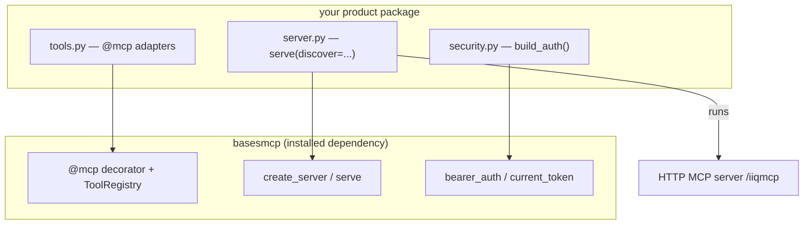
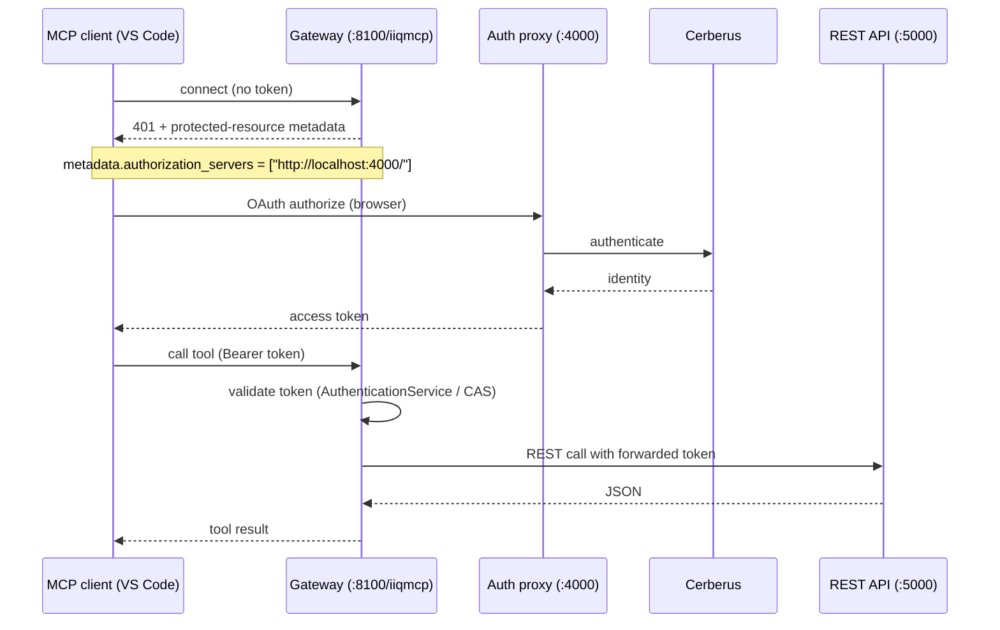

# MCP Wrapper (`basesmcp`) — Research Spike & Integration Guide

**Status:** Validated spike — reference implementation running in [`src/mcp_gateway/`](../src/mcp_gateway)
**Date:** 2026-09-20
**Audience:** Product engineers who want to expose an existing Python service's APIs as MCP tools
**Library:** `basesmcp` — https://github.com/REKA3003/SAI-MCP-Wrapper (MIT · Python ≥ 3.10 · built on FastMCP 3.x)

---

## 1. TL;DR

- `basesmcp` is a small, reusable library. Decorate any function with `@mcp`, and `serve(discover=...)` auto‑registers it as an MCP tool and runs an HTTP MCP server.
- To add MCP to a product you write only three things: **(1)** a tools module (`@mcp` adapters), **(2)** a ~15‑line launcher, and optionally **(3)** auth wiring. The server engine itself lives in the library — you never reimplement it.
- Reference implementation: `src/mcp_gateway/` exposes 6 conversation endpoints and authenticates through the existing auth proxy (`:4000`) → Cerberus.

---

## 2. Spike goal

Products in the fleet have a REST API (and historically a UI). We want to expose those APIs to LLM/agent clients via the **Model Context Protocol (MCP)** without rebuilding each service.

**Question:** Can a single reusable wrapper let any Python product expose its APIs as MCP tools with one decorator, while reusing the product's existing authentication?

**Answer:** Yes — validated end‑to‑end (tool registration, HTTP transport, OAuth discovery pointing at the auth proxy, and token forwarding to the REST API).

---

## 3. Mental model — two layers

The wrapper is **not** a second server you maintain. There are two distinct layers:

| Layer | Lives in | Responsibility | Reused across products? |
|---|---|---|---|
| **Engine** | `basesmcp` (pip package) | Build the FastMCP server, register discovered tools, run uvicorn/HTTP, bootstrap OAuth discovery | ✅ Yes |
| **Launcher + tools** | your product (e.g. `src/mcp_gateway/`) | Declare *which* functions are tools, *which* auth, *which* port; then call the engine | ❌ Unique per product |



Analogy: Flask ships a server (`app.run()`), yet your project still has `main.py`/`wsgi.py` to wire routes + config and launch it. The launcher is the composition root, not duplication.

---

## 4. Library API reference

```python
from basesmcp import (
    mcp,               # the decorator (aliases: tool, mcp_tool)
    create_server,     # build a FastMCP server with all discovered tools
    serve,             # build + run over HTTP (blocking)
    bearer_auth,       # wrap your token validation into a FastMCP auth provider
    current_token,     # the caller's bearer token inside a tool
    current_claims,    # the caller's JWT claims inside a tool
    ToolRegistry,      # isolated registry (tests / advanced)
)
```

| Symbol | Purpose |
|---|---|
| `@mcp` / `@mcp(name=..., tags={...})` | Mark a function as an MCP tool (bare or parameterized). Returns the function unchanged. |
| `create_server(name=, instructions=, auth=, discover=, registry=)` | Build a `FastMCP` server with every discovered tool registered. |
| `serve(..., host=, port=, path=, transport="http")` | Build **and** run the server. |
| `bearer_auth(verify=, authorization_servers=[...], base_url=)` | Build a FastMCP `RemoteAuthProvider` from your own `verify(token)` callback. |
| `current_token()` / `current_claims()` | Read the authenticated caller's token/claims inside a tool. |

---

## 5. Step‑by‑step: add `basesmcp` to a product

> Concrete reference for every step: [`src/mcp_gateway/`](../src/mcp_gateway).

### Step 1 — Install the library

Add to `requirements.txt` (public repo, so no auth needed):

```pip-requirements
basesmcp @ git+https://github.com/REKA3003/SAI-MCP-Wrapper.git@main
# once published to a registry:  basesmcp==0.1.0
```

```powershell
python -m pip install -r requirements.txt
```

### Step 2 — Create the tools module (`@mcp` adapters)

Each tool is a **thin, typed adapter** that calls your existing endpoint/service. The function signature + docstring is the contract the client model uses to pick the tool, so keep them clear.

```python
# src/<product>/mcp_tools.py
from typing import Any, Optional
from basesmcp import mcp
from src.<product>.rest_client import request_json

@mcp(name="list_threads", tags={"conversations"})
async def list_threads(org_id: str, search_text: Optional[str] = None) -> Any:
    """List the user's conversation threads in an organization."""
    return await request_json("GET", f"/api/clients/{org_id}/threads",
                              params={"search_text": search_text})
```

> ⚠️ **What to annotate:** plain functions, service‑layer methods, or HTTP‑proxy functions — **never** Flask/Django route handlers. Those read `request`/`g` and return framework `Response` objects, so they can't be MCP tools. See [§8](#8-best-practices).

### Step 3 — REST client + token forwarding

If the tools proxy your REST API, add a small async client that forwards the caller's token:

```python
# src/<product>/rest_client.py
import os, httpx
from basesmcp import current_token

def _headers() -> dict:
    token = current_token() or os.getenv("SERVICE_FORWARD_TOKEN")
    return {"Authorization": f"Bearer {token}"} if token else {}

async def request_json(method, path, *, params=None, json_body=None):
    async with httpx.AsyncClient(base_url=os.getenv("SERVICE_BASE_URL", "http://127.0.0.1:5000")) as c:
        r = await c.request(method, path, params=params, json=json_body, headers=_headers())
        return r.json() if r.is_success else {"error": True, "status_code": r.status_code}
```

`current_token()` returns the bearer token the MCP client sent — so the user's identity flows all the way through to the REST API.

### Step 4 — Wire auth (optional, reuses your existing validation)

Reuse the product's existing token validator; only expose it to the engine:

```python
# src/<product>/security.py
import os
from basesmcp import bearer_auth
from src.config import get_config

def _verify(token: str):
    from fastmcp.server.auth import AccessToken
    from src.services.security.authentication_service import AuthenticationService
    try:
        claims = AuthenticationService().validator.get_user_info(token.replace("Bearer ", ""))
    except Exception:
        return None
    return AccessToken(token=token, client_id=str(claims.get("userId")),
                       scopes=list(claims.get("roles") or []), expires_at=claims.get("exp"))

def build_auth():
    if os.getenv("MCP_GATEWAY_NO_AUTH", "").lower() in ("1", "true", "yes"):
        return None                                   # open mode for local testing
    proxy = get_config("AUTHPROXY_URL")
    if not proxy:
        return None
    return bearer_auth(verify=_verify, authorization_servers=[proxy],
                       base_url=os.getenv("MCP_GATEWAY_BASE_URL", "http://127.0.0.1:8100"))
```

### Step 5 — Create the launcher (`server.py`)

This is the whole "server" — ~15 lines of project config handed to the engine:

```python
# src/<product>/server.py
import os
from basesmcp import serve
from src.config import initialize
from src.<product>.security import build_auth

def main():
    initialize()                                  # load .env
    serve(
        name="My Product MCP Gateway",
        auth=build_auth(),                        # Step 4
        discover="src.<product>.mcp_tools",       # imports Step 2 → runs @mcp → registers
        host=os.getenv("MCP_GATEWAY_HOST", "127.0.0.1"),
        port=int(os.getenv("MCP_GATEWAY_PORT", "8100")),
        path=os.getenv("MCP_GATEWAY_PATH", "/iiqmcp"),
    )

if __name__ == "__main__":
    main()
```

### Step 6 — Run & test

**A. In‑process smoke test (zero infra):** a `verify.py` that starts a stub backend and calls the tools through the in‑memory client. Reference: [`src/mcp_gateway/verify.py`](../src/mcp_gateway/verify.py).

```powershell
python -m src.mcp_gateway.verify
# Registered tools (via basesmcp): ['create_thread', 'list_threads', ...]
```

**B. Real HTTP server + client (2 terminals):**

```powershell
# Terminal 1 — server (open mode for local):
$env:MCP_GATEWAY_NO_AUTH="1"
python -m src.mcp_gateway.server            # → http://127.0.0.1:8100/iiqmcp

# Terminal 2 — client:
python -m src.mcp_gateway.client            # connects + lists tools
```

**C. Real MCP clients** pointing at `http://127.0.0.1:8100/iiqmcp`:
- **VS Code** — `.vscode/mcp.json`:
  ```json
  { "servers": { "my-mcp": { "url": "http://127.0.0.1:8100/iiqmcp", "type": "http" } } }
  ```
- **MCP Inspector** — `npx @modelcontextprotocol/inspector` → HTTP → the URL.

---

## 6. The authenticated flow (→ auth proxy → Cerberus)

When auth is **on** (i.e. `MCP_GATEWAY_NO_AUTH` unset and `AUTHPROXY_URL` configured), the server advertises the auth proxy and the client runs a standard OAuth handshake:



**Verified metadata** served by the gateway (`GET /.well-known/oauth-protected-resource/iiqmcp`):

```json
{
  "resource": "http://127.0.0.1:8100/iiqmcp",
  "authorization_servers": ["http://localhost:4000/"],
  "bearer_methods_supported": ["header"]
}
```

> Gotcha found during the spike: the gateway must advertise **its own** base URL (`:8100`), not the shared `MCP_BASE_URL` (`:8000`, used by the legacy `src/mcp` server). Fixed via `MCP_GATEWAY_BASE_URL`.

---

## 7. Reference implementation — file map

| File | Role | Maps to step |
|---|---|---|
| [`src/mcp_gateway/tools.py`](../src/mcp_gateway/tools.py) | `@mcp` adapters for 6 conversation endpoints | Step 2 |
| [`src/mcp_gateway/rest_client.py`](../src/mcp_gateway/rest_client.py) | httpx proxy + `current_token()` forwarding | Step 3 |
| [`src/mcp_gateway/security.py`](../src/mcp_gateway/security.py) | `build_auth()` (CAS/Cerberus) + `MCP_GATEWAY_NO_AUTH` | Step 4 |
| [`src/mcp_gateway/server.py`](../src/mcp_gateway/server.py) | launcher: `serve(discover=...)` | Step 5 |
| [`src/mcp_gateway/verify.py`](../src/mcp_gateway/verify.py) | in‑process demo (stub backend) | Step 6A |
| [`src/mcp_gateway/client.py`](../src/mcp_gateway/client.py) | HTTP test client | Step 6B |

Tools are chosen by decorating the desired endpoints; only those become MCP tools.

---

## 8. Best practices

1. **Annotate framework‑agnostic functions**, not route handlers. Route handlers use `g`/`request` and return `Response` — incompatible with MCP's typed‑args/JSON‑out model.
2. **Curate task‑level tools**, not a 1:1 dump of every endpoint. Clear names + docstrings + type hints = accurate tool selection by the model.
3. **Forward identity** with `current_token()` so the REST API still enforces per‑user access.
4. **Keep the launcher thin.** All server logic belongs to `basesmcp`; the launcher only supplies config.
5. **Don't duplicate business logic** — adapters call the existing endpoint/service; logic lives once.

---

## 9. Configuration reference

| Env var | Used by | Default | Meaning |
|---|---|---|---|
| `MCP_GATEWAY_HOST` | launcher | `127.0.0.1` | Bind host (`0.0.0.0` in containers) |
| `MCP_GATEWAY_PORT` | launcher | `8100` | Bind port |
| `MCP_GATEWAY_PATH` | launcher | `/iiqmcp` | MCP endpoint path |
| `MCP_GATEWAY_BASE_URL` | auth | `http://127.0.0.1:8100` | Public URL advertised in OAuth metadata |
| `MCP_GATEWAY_NO_AUTH` | auth | *(unset)* | `1` = run unauthenticated (local testing only) |
| `AUTHPROXY_URL` | auth | *(from .env)* | Auth proxy / authorization server (`http://localhost:4000`) |
| `IIS_BASE_URL` / `SERVICE_BASE_URL` | rest client | `http://127.0.0.1:5000` | Base URL of the product's REST API |
| `IIS_FORWARD_TOKEN` | rest client | *(unset)* | Fallback bearer token for local runs |

---

## 10. Troubleshooting

| Symptom | Cause | Fix |
|---|---|---|
| Client gets `401 Unauthorized` | Auth is on but no token | Use `MCP_GATEWAY_NO_AUTH=1` for local, or connect via the OAuth flow |
| `port 8100 in use` | A previous server is still running | `Get-NetTCPConnection -LocalPort 8100` → `Stop-Process -Id <pid>` |
| OAuth resource mismatch | `base_url` points to the wrong port | Set `MCP_GATEWAY_BASE_URL` to the gateway's real URL |
| Tool call returns `connection failed` | REST backend not running | Start the product API (e.g. `python -m src.main`) and set `*_BASE_URL` |
| Tools not registered | `discover=` points at the wrong module | Point it at the module that has the `@mcp` functions |

---

## 11. Publishing / versioning the library

```powershell
python -m build                     # build sdist + wheel
python -m twine check dist/*
python -m twine upload dist/*       # PyPI (public) or Azure Artifacts (private feed)
```

Then consumers pin it in `requirements.txt` (`basesmcp==0.1.x`). A `publish.yml` GitHub Action can publish automatically on release via PyPI Trusted Publishing. Bump the version in `pyproject.toml` per release (SemVer).

---

## 12. Outcome

The spike confirms a single reusable wrapper (`basesmcp`) lets any Python product expose curated APIs as MCP tools with one decorator, reuse existing auth (auth proxy → Cerberus), and forward user identity to the REST API. Per‑product cost is a tools module + a ~15‑line launcher (+ optional auth wiring). The legacy `src/mcp` server can eventually be retired in favor of the `basesmcp` + gateway pair to remove the only genuine duplication.
